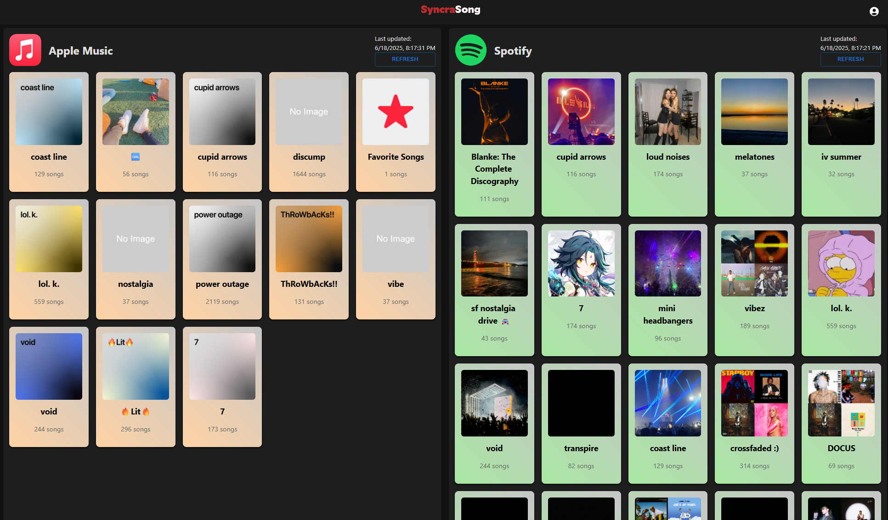
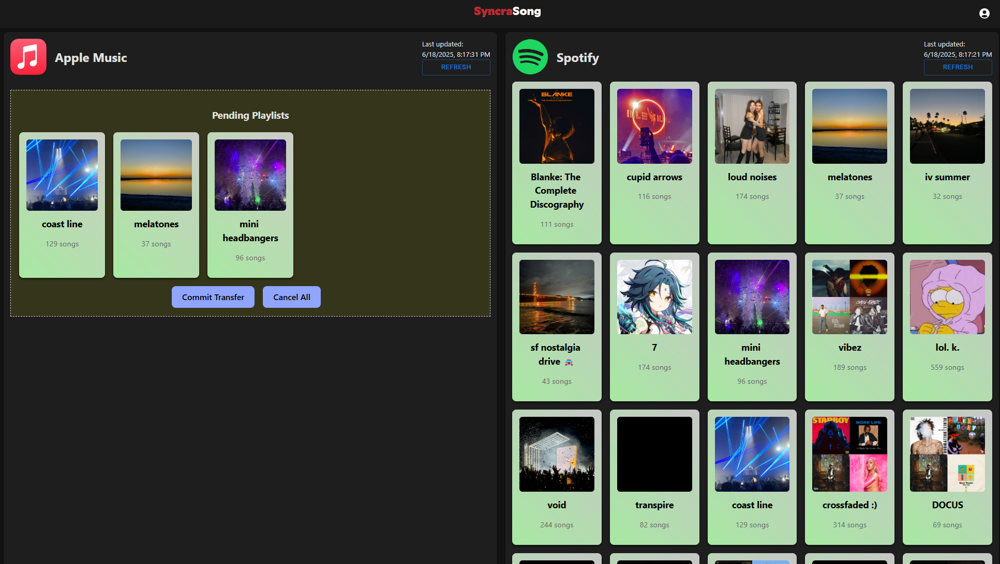

# SyncraSong Web App (Work In-progress)
### This is a public repository, subject to change.
**This repository is not for distribution.**

This project is currently in development.
Hosted on: [https://syncrasong.austin.kim/](https://syncrasong.austin.kim/)

Everything is hosted on a local server for now.

### Description
SyncraSongTS is a front-end web application, utilizing the [SyncraSongAPI](https://github.com/austinkimchi/SyncraSongAPI) (private repository, also made by me). This full-stack application utilizes the MERN stack, utilizing MongoDB (self-hosted), Express.JS, React, and Node.js.  
Utilized Codex for slight UI design.

### TODO:
- [ ] Transfer functionality: **Apple Music** to **Spotify**
- [ ] Pane switching: Select platform on either left and right pane instead of hardfixing it
- [ ] Add user settings
- [ ] User creation feature (Yes, I know I added the login without a way to create users for now)
- [ ] More platforms (Tidal, Youtube Music, Soundcloud, etc.)

More to come...

### Completed Tasks:
- [x] Implement playlist fetching on service linked account (Spotify/Apple Music)
- [x] Access to RESTAPI for basic functions: get userID, session token
- [x] oAuth link access through front-end side
- [x] Transfer functionality: **Spotify** to **Apple Music**
- [x] Transfer functionality: Simple Queuing System
- [x] Dark and Light mode implementation
- [x] UI elements dragging functionality (might remove soon, unnecessary)
- [x] UI elements clicking functionality (stage and unstage pending playlist)

### Current State
<!-- image at ./src/assets/images/Screenshot 2024-12-29 222231.png-->

>[!Tip]
> Users can click or drag playlists across the platform seemlessly.  
> The yellow box is the staging area before they confirm to transfer.

>[!Note]
> If songs are cached: A playlist of 1000 songs takes 9 seconds on average to transfer.  
> If songs are uncached: A playlist of 1000 songs will take 5 minutes on average to transfer.  
> Cached songs are stored in a medium, where other users have already transfer it before. If the songs that are mapped are incorrect, please report it at syncrasong@austin.kim.

### Contributor(s)
[Austin Kim](https://github.com/austinkimchi)

### License
This project is licensed under the MIT License - see the [LICENSE](LICENSE) file for details.
