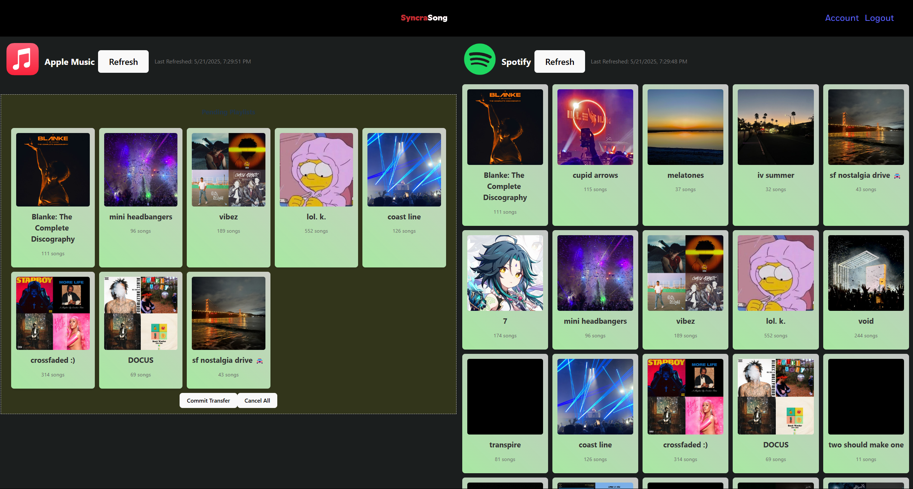

# SyncraSong (Typescript React) Web App (On-going project)
## This is a public repository, subject to change.
This repository is not for distribution.

This project is currently in development, the site is most likely down.
Hosted on: [https://syncrasong.austin.kim/](https://syncrasong.austin.kim/)

Currently hosting locally, once transfer functionality is implemented, will be hosted on server.

### Description
This repository, SyncraSong, is a front-end web application that retrieves from the [SyncraSongAPI](https://github.com/austinkimchi/SyncraSongAPI) (private repository) and displays the data in a user-friendly manner. The application is built using React.js.  
This web-application is still in development and is almost ready for public usage.
The core APIs for fetching playlists are working.

### TODO:
- [ ] (In-progress) Transfer functionality: Most likely going to use queuing system.
- [ ] UI elements dragging functionality (to stage to transfer playlist)
- [ ] UI elements clicking functionality (to stage to transfer playlist)
- [ ] (Private API side) Set up transfer implementation, passing Array of IDs[], fromProvider, toProvider.
- [ ] Dark/Light mode implementation
- [ ] More platforms (Tidal, Youtube Music, Soundcloud, etc.)

More to come...

### Completed Tasks:
- [x] Implement playlist fetching on service linked account (Spotify/Apple Music)
- [x] Access to RESTAPI for basic functions: get userID, session token
- [x] oAuth link access through front-end side
- [x] Proper login handler (some bugs)

### Current State
<!-- image at ./src/assets/images/Screenshot 2024-12-29 222231.png-->

>[!Tip]
> Users can drag playlists across the platform seemlessly.  
> The yellow box is the staging area before they confirm to transfer.

### Contributor(s)
[Austin Kim](https://github.com/austinkimchi)

### License
This project is licensed under the MIT License - see the [LICENSE](LICENSE) file for details.
