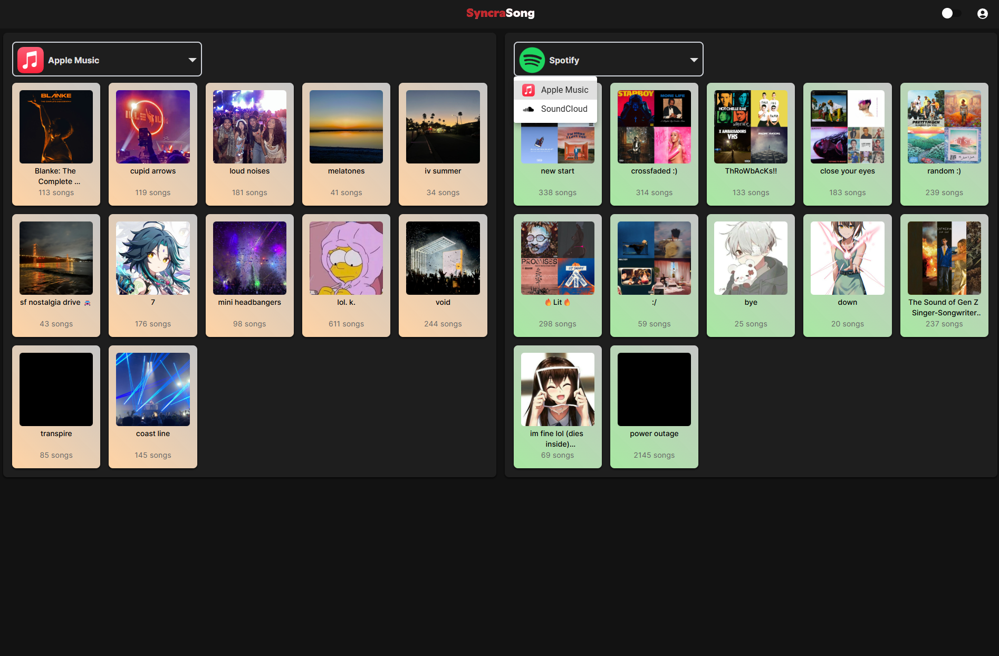

# SyncraSong Web App

  

    
    
    
    
  

### 🪧 Notice  
This is a **public repository** currently under active development.  
**Not intended for redistribution or derivative use.**

Hosted at: [https://ssv2.austin.kim/](https://ssv2.austin.kim/)

---

## 📖 Overview
**SyncraSongTS** is a front-end web application built using the **MERN stack** — MongoDB, Express.js, React, and Node.js.  
It connects to the companion back-end service, [SyncraSongTSAPI](https://github.com/austinkimchi/SyncraSongTSAPI) (**private repository**) for playlist transfer and synchronization features.  

> [!IMPORTANT]
> **You must be an active Apple Music subscriber** to link your Apple Music account with this app.  
> Spotify accounts can be either free or premium. 
---

## 🚧 In Progress  
- [ ] Transfer queuing system / load balancing  
- [ ] Pane switching (selectable left/right platform panes)  
- [ ] SoundCloud integration  

---

## 📝 TODO  
- [ ] List view for playlists (in addition to grid view)
- [ ] Spotify: Fetch full user library (Blends, Liked Songs, etc.)  
- [ ] User settings panel  
- [ ] UI rebrand after feature completion  
- [ ] Add support for additional platforms (Tidal, YouTube Music, etc.)  

---

## ✅ Completed  
- [x] Automatic playlist fetching for authenticated users  
- [x] RESTful API integration with back-end  
- [x] Drag-and-drop UI interaction  
- [x] OAuth 2.x authentication via back-end  
- [x] Cross-platform music transfer: **Spotify ↔ Apple Music**  
- [x] Dark / Light theme toggle  

---

## 📸 Current State (as of 10/17/2025)  
  

> [!TIP]  
> Users can **drag** playlists between platforms.  
> The yellow box represents the **staging area** before confirming a transfer.  

  

> [!NOTE]  
> **Performance Estimates:**  
> - Cached playlists (~100 songs): ~6 seconds  
> - Uncached playlists (~100 songs): ~41 seconds  
>   - Spotify → Apple Music: ~29s  
>   - Apple Music → Spotify: ~53s  

---

## 👤 Contributor  
- [Austin Kim](https://github.com/austinkimchi)

---

## 📄 License  
This project is licensed under the **GNU License** — see the [LICENSE](LICENSE) file for details.
